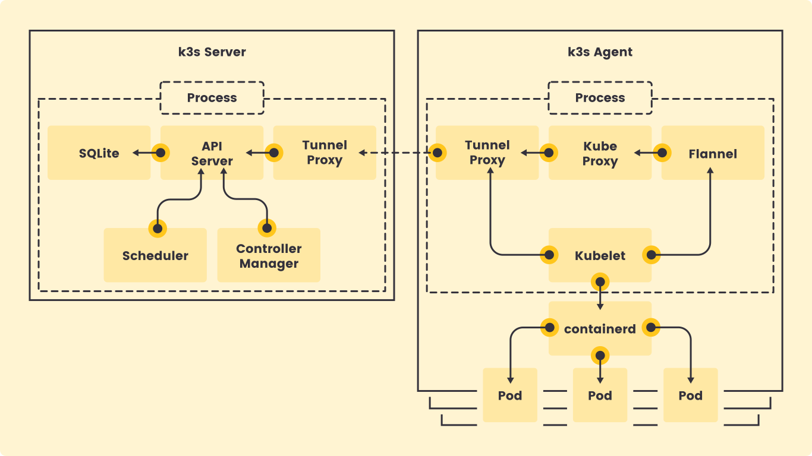
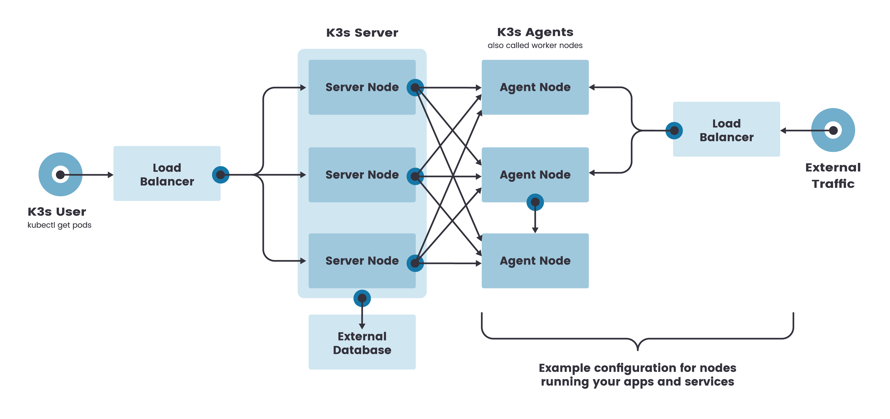

# K3s, K3d and JenkinX Whitepaper

## What is Edge computing

### Definition

Edge computing is a distributed computing paradigm that brings computation and data storage closer to the location where it is needed, to improve response times and save bandwidth.

### Motive

In the age of microservices, it's not strange to see the need of more than one embedded system working together to do a huge amount of work that's not possibe with one embedded system. From analytics to operational control of systems, there is a lot of different applocations that can be run out at the network edge.

The increase of IoT devices at the edge of the network is producing a massive amount of data to be computed at data centers, pushing network bandwidth requirements to the limit. Despite the improvements of network technology, data centers cannot guarantee acceptable transfer rates and response times, which could be a critical requirement for many applications.

Devices at the edge constantly consume data coming from the cloud, forcing companies to build content delivery networks to decentralize data and service provisioning, to benefit from physical proximity to the end user.

### Goal

The aim of Edge Computing is to move the computation away from data centers towards the edge of the network, exploiting smart objects, mobile phones or network gateways to perform tasks and provide services on behalf of the clou. By moving services to the edge, it is possible to provide content caching, service delivery, storage and IoT management resulting in better response times and transfer rates.

### Containers at the edge

Containers and Kubernetes are an excellent choice for deploying complex software to the edge. They are consistenct, can work in standalone or cluster modes, easy to upgrade, provide support for different configs (storage, CPU intensive) and have a wide ecosystem that provides monintoring, logging, CI, etc.

However, there are many challenges facing running Kuberenets at the edge

- Most kuberenetes distributions do not support ARM processors
- Kubernetes can easily consume up to 4 GB of RAM
- Kuberenetes was not built for offline management or embedded systems

## K3s

[K3s](https://k3s.io/) is a fully compliant Kubernetes distribution with some enhancements

### K3s Features

- Packaged as a single binary.
- Lightweight storage backend based on SQLite3 as the default storage mechanism. etcd3, MySQL, Postgres also still available.
-Simple launcher that handles a lot of the complexity of TLS and options.
- Secure by default with reasonable defaults for lightweight environments.
- Operation of all Kubernetes control plane components is encapsulated in a single binary and process. This allows K3s to automate and manage complex cluster operations like distributing certificates.
- Minimized external dependencies (just a modern kernel and cgroup mounts needed)
- Removes legacy and non default features, as well as alpha features.
- Removes In-tree cloud providers support, a cloud native Kuberenetes distribution will be more suitable and integrated with a cloud platform.
- Removes and In-tree storage drivers as they are available as add-ons.
- Removes the dependency on Docker and uses containerd instead.
- Simple but powerful “batteries-included” features have been added, such as:
  - Local storage provider
  - Service load balancer
  - Helm package manager controller
  - Traefik ingress controller

### K3s usecases

1. Edge computing and embedded systems
2. IOT Gateway
3. CI Environments
4. Single-App clusters

### K3s Architecture

A server node is defined as a machine (bare-metal or virtual) running the `k3s server` command. A worker node is defined as a machine running the `k3s agent` command.



- Single-server setup with an embedded datbase

  A server node is defined as a machine (bare-metal or virtual) running the k3s server command. A worker node is defined as a machine running the k3s agent command.

  

- High-Availability K3s Server with a database

  Single server clusters can meet a variety of use cases, but for environments where uptime of the Kubernetes control plane is critical, K3s can be run in an HA configuration. HA K3s cluster is comprised of:
  - Two or more server nodes that will serve the Kubernetes API and run other control plane services.
  - A datastore (that can be external or the expiremental DQlite embedded database).

  

- Agent node registeration

  Agent nodes are registered with a websocket connection initiated by the k3s `agent` process, and the connection is maintained by a client-side load balancer running as part of the agent process.

  Agents will register with the server using the node cluster secret along with a randomly generated password for the node. The server will store the passwords for individual nodes, and any subsequent attempts must use the same password.

  If the stored password of an agent is removed from the agent, the password file should be recreated for the agent, or the entry removed from the server.

  A unique node ID can be appended to the hostname by launching K3s servers or agents using the `--with-node-id` flag.

### K3s Demo

- Single node

  ``` Powershell
  multipass launch -n k3s
  multipass exec k3s -- bash -c "curl -sfL https://get.k3s.io | K3S_KUBECONFIG_MODE='644' sh -"
  multipass exec k3s -- sudo kubectl get nodes
  docker pull nginxdemos/hello
  docker tag nginxdemos/hello:latest localhost:5000/k3s-demo
  docker push localhost:5000/k3s-demo
  # docker image remove nginxdemos/hello:latest localhost:5000/k3s-demo
  # docker pull localhost:5000/k3s-demo
  # add Host IP to /etc/hosts
  sudo sh -c "echo '192.168.1.6 localhost' >> /etc/hosts"
  # create config.yaml
  nano ~/config.yaml
  # apply config
  sudo kubectl apply -f config.yaml
  # get ip
  sudo kubectl get ingress,svc,pods -n k3s-demo
  curl -k -X GET https://<IP>
  ```

- Cluster with highly available embedded database DQlite

  ``` Powershell
  multipass launch -n k3s-cluster
  multipass launch -n k3s-cluster-node-1
  multipass launch -n k3s-cluster-node-2
  multipass exec k3s-cluster -- bash -c "curl -sfL https://get.k3s.io | INSTALL_K3S_EXEC='server --cluster-init' sh -s -"
  $TOKEN=$(multipass exec k3s-cluster sudo cat /var/lib/rancher/k3s/server/node-token)
  $IP = multipass info k3s-cluster | Select-String IP | %{($_ -split ':')[1].trim()}
  multipass exec k3s-cluster-node-1 -- bash -c "curl -sfL https://get.k3s.io | INSTALL_K3S_EXEC='server --server https://$($IP):6443' K3S_URL=https://$($IP):6443 K3S_TOKEN=$($TOKEN) sh -s -"
  # modify start script @ /etc/systemd/system/k3s.service to use sudo
  multipass exec k3s-cluster-node-2 -- bash -c "curl -sfL https://get.k3s.io | INSTALL_K3S_EXEC='server --server https://$($IP):6443' K3S_URL=https://$($IP):6443 K3S_TOKEN=$($TOKEN) sh -s -"
  # modify start script @ /etc/systemd/system/k3s.service to use sudo
  
  ```

## K3D

[K3d](https://k3d.io/) is a lightweight wrapper to run k3s in docker. K3d makes it very easy to create single-node and multi-node k3s clusters in docker, e.g. for local development on Kubernetes.

### Shortcomings

- External datastores are not yet available in k3d

### Usage

``` Powershell
k3d cluster create k3d-cluster --image rancher/k3s:v1.18.8-k3s1  --servers 1 --agents 3
# HA cluster
k3d cluster create k3d-cluster --image rancher/k3s:v1.18.8-k3s1 --servers 3 --agents 3
```

## Jenkins X

Jenkins X provides pipeline automation, built-in GitOps, and preview environments to help teams collaborate and accelerate their software delivery at any scale.

### Setup

- Trial 1 on windows machine has failed.
- Trial 2 on Ubuntu multipass instance

  ``` Powershell
  multipass launch -n jx
  multipass shell jx
  sudo apt-get update
  # install docker
  sudo apt-get install apt-transport-https ca-certificates curl gnupg-agent software-properties-common
  curl -fsSL https://download.docker.com/linux/ubuntu/gpg | sudo apt-key add -
  sudo add-apt-repository "deb [arch=amd64] https://download.docker.com/linux/ubuntu $(lsb_release -cs) stable"
  sudo apt-get update
  sudo apt-get install docker-ce docker-ce-cli containerd.io
  # install k3d
  curl -s https://raw.githubusercontent.com/rancher/k3d/main/install.sh | bash
  # install jx
  curl -L "https://github.com/jenkins-x/jx/releases/download/$(curl --silent "https://github.com/jenkins-x/jx/releases/latest" | sed 's#.*tag/\(.*\)\".*#\1#')/jx-linux-amd64.tar.gz" | tar xzv "jx"
  sudo mv jx /usr/local/bin
  # install kubectl
  # can be skipped since it will be installed with jx bot
  curl -LO "https://storage.googleapis.com/kubernetes-release/release/$(curl -s https://storage.googleapis.com/kubernetes-release/release/stable.txt)/bin/linux/amd64/kubectl"
  chmod +x ./kubectl
  sudo mv ./kubectl /usr/local/bin/kubectl
  # create cluster
  sudo su
  k3d cluster create jx-cluster --image rancher/k3s:v1.18.8-k3s1 --timeout 300s --servers 1 --agents 1 -p 8081:80@loadbalancer --api-port 5678 --update-default-kubeconfig
  # get ingress external IP
  kubectl get services -n kube-system
  # boot jx
  jx boot # accept repo download > fails
  # modify jx-requirements
  # replace gke with kubernetes
  # modify ingress domain to $IP.nip.io and add ignoreLoadBalancer: true
  # save
  cd jenkins-x-boot-config/
  nano jx-requirements.yml
  # run boot jx again and answer questions to setup
  jx boot
  # add nginx service
  ##kubectl create deployment nginx --image=nginx -n kube-system
  ##kubectl create service clusterip nginx --tcp=80:80 -n kube-system
  ##kubectl apply -f <nginx.yaml>
  ##jx install --provider=kubernetes --skip-ingress --external-ip=10.43.223.87 --ingress-service=service/nginx --ingress-deployment=deployment.apps/nginx --ingress-namespace=kube-system
  ```

### K3s and External database
  
- Notice the need for an external L4 load balancer in front of the master nodes
- Unlike embedded HA, this will avoid the cluster going down if the main node is down

  ``` Powershell
  multipass launch -n postgres-db
  multipass exec postgres-db sudo apt update
  multipass exec postgres-db sudo apt install postgresql
  multipass exec sudo nano /etc/postgresql/12/main/postgresql.conf
  # change listen_addresses = '*'
  multipass exec sudo nano /etc/postgres/12/main/pg_hba.conf
  # add host all all 192.168.72.0/24 trust to allow all connections for multipass range
  multipass exec sudo systemctl restart postgresql
  # optionally create database .. k3s creates default if none is defined
  multipass launch -n k3s-lb -m 512M
  multipass launch -n k3s-server-1 -m 512M
  multipass launch -n k3s-server-2 -m 512M
  multipass exec k3s-lb -- bash -c "sudo snap install --edge gobetween"
  multipass exec k3s-lb -- bash -c "sudo nano /var/snap/gobetween/# common/gobetween.toml"
  # # change bind to servers.sample to "0.0.0.0:6443"
  # # add server IPs to static_list "IP:6443 weight=100"
  multipass exec k3s-lb sudo snap restart gobetween
  $DB_IP = multipass info postgres-db | Select-String IP | %{($_ -split ':')[1].trim()}
  multipass exec k3s-server-1 -- bash -c "curl -sfL https://get.k3s.io | K3S_DATASTORE_ENDPOINT='postgres://postgres@$($DB_IP):5432/kube' INSTALL_K3S_EXEC='--write-kubeconfig-mode 644 -t orPLcIQSeOzOUOpTZsqALIYU1mJ9rQVo --tls-san k3s.example.com --node-taint k3s-controlplane=true:NoExecute' sh -s - server"
  multipass exec k3s-server-2 -- bash -c "curl -sfL https://get.k3s.io | K3S_DATASTORE_ENDPOINT='postgres://postgres@$($DB_IP):5432/kube' INSTALL_K3S_EXEC='--write-kubeconfig-mode 644 -t orPLcIQSeOzOUOpTZsqALIYU1mJ9rQVo --tls-san k3s.example.com --node-taint k3s-controlplane=true:NoExecute' sh -s - server"
  multipass exec k3s-server-1 sudo nano /etc/rancher/k3s/k3s.yaml
  # modify server to gobetween ip
  multipass exec k3s-server-2 sudo nano /etc/rancher/k3s/k3s.yaml
  # modify server to gobetween ip
  multipass launch -n k3s-agent-1
  multipass launch -n k3s-agent-2
  $IP = multipass info k3s-lb | Select-String IP | %{($_ -split ':')[1].trim()}
  $TOKEN=$(multipass exec k3s-master-1 sudo cat /var/lib/rancher/k3s/server/node-token)
  multipass exec k3s-agent-1 -- bash -c "curl -sfL https://get.k3s.io | sh -s - agent --server https://$($IP):6443 -t $($TOKEN)  --node-label node-role.kubernetes.io/worker=worker"
  multipass exec k3s-agent-2 -- bash -c "curl -sfL https://get.k3s.io | sh -s - agent --server https://$($IP):6443 -t $($TOKEN)  --node-label node-role.kubernetes.io/worker=worker"
  multipass exec k3s-master-1 nano ~/config.yaml
  # paste configuration
  multipass exec k3s-master-1 -- bash -c "sudo kubectl create namespace k3s-demo"
  multipass exec k3s-master-1 -- bash -c "sudo kubectl appy -f ~/config.yaml"
  multipass exec k3s-master-1 -- bash -c "sudo kubectl get pods,services,ingress -n k3s-demo"
  # change config and notice change
  multipass exec k3s-master-1 nano ~/config.yaml
  multipass exec k3s-master-1 -- bash -c "sudo kubectl appy -f ~/config.yaml"
  multipass exec k3s-master-1 -- bash -c "sudo kubectl get pods,services,ingress -n k3s-demo"

  ```

### Buildpacks

#### What is a buildpack

A buildpack’s job is to gather everything an app needs to build and run, and it often does this job quickly and quietly. They are at the heart of transforming source code into a runnable app image.

Buildpacks are a good separation of concerns. It allow groups of equally enthusiastic teams to work together, each excelling in their own job. The developer's job is to focus on writing a good application, while someone is writing a buildpack for the framework/language and testing it against many other applications.

Using auto-detection, groups of buildpacks are sequentially tested against app’s source code and the first group that deems fit for source code will become the selected set of buildpacks for an app. Detection criteria is specific to each buildpack – for instance, an NPM buildpack might look for a package.json, and a Go buildpack might look for Go source files.

A builder is an image that bundles all the bits and information on how to build your apps, such as buildpacks and build-time image, as well as executes the buildpacks against your app source code.

#### How to use

- Select a builder  
  - To build an app, first decide which builder to use. A builder includes the buildpacks that will be used as well as the environment for building your app.

  - When using pack, run `pack suggest-builders` for a list of suggested builders. Many builder are available for the well-known languages like Java(Maven/Gradle), Go, PHP, Ruby, Python, etc.

- Build app
  
  After deciding on what builder to use, build the app using `pack build` command. To avoid specifying a builder each time set default builder using `pack set-default-builder <Builder>`
  
  ``` Bash
  pack build sample-app \
  --path samples/apps/java-maven \
  --builder cnbs/sample-builder:bionic
  ```

- Run app
  
  Run application using `docker run --rm -p 8080:8080 sample-app`

### kpack

We have seen how `pack` works and how it builds a docker image from an application with ease, but where will one run `pack build` for a production applications, and what will trigger `pack build` to run when new Git commits are pushed?

One solution is to setup a CI system to watch the Git repos, watch for updates to buildpacks, and run `pack build` automatically. Another solution is to use kpack.

kpack uses the same system as the `pack` CLI, combined with the ability to watch for changes in both the source Git repository, and the upstream buildpacks. If anything changes then the application is re-built and a new Docker image is created.
`

```
mkdir kpack
cd kpack
curl https://github.com/pivotal/kpack/releases/download/v0.1.2/release-0.1.2.yaml -o kpack.yaml
k3d cluster create k3d-cluster --image rancher/k3s:v1.18.8-k3s1  --servers 1 --agents 2
kubectl apply -f kpack.yaml
